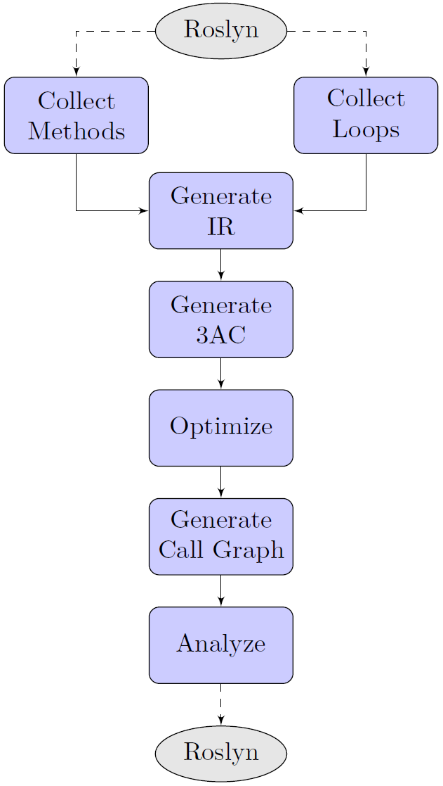
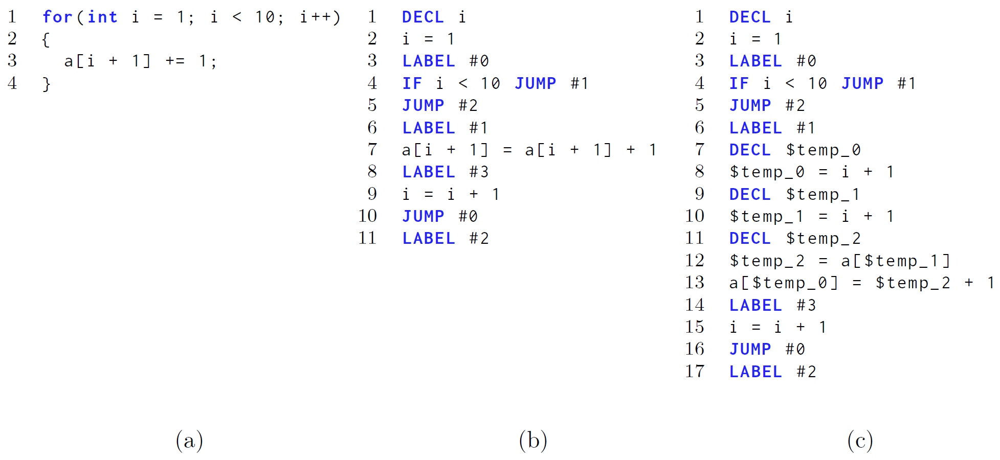

# 1 RefactorToParallel

Sourcecode of the prototype of the Master's Thesis Automatic Refactoring for Parallelization

# 2 Implementation Notes

The prototype is a static code analyzer available as a Visual Studio Plugin as well as a NuGet package. Its only dependency is the .NET Compiler Platform (Roslyn) which is used analyze arbitrary C# code. The Visual Studio integration allows just-in-time code analysis and automatically reports `for` loops that can be refactored to their `Parallel.For` counterpart safely. The following screenshot illustrates how the prototype informs about the parallelization opportunity including a preview of the code changes.

In the upcoming Section 2.1, the steps the prototype uses for its analysis are explained.

## 2.1 Analysis Steps

The prototype was designed in a way that the different parts (or steps) of the analysis are not crucial for the implementation and can be added gradually. This design choice was also the primary reason not to use an IR in the SSA form.

The image below sketches the steps of the final implementation. First of all, the prototype collects the available methods and for loops. Currently, the prototype only collects loops doing a single-step increment. Next, the body of the loop is transformed into an intermediate representation. During this conversion, the responsible unit also applies various semantic proofs. Then, the IR is transformed into a three-address code and optimized. Out of the optimized three-address code, the prototype creates a call graph which links method invocations with the corresponding control flow graph. Last but not least, it analyzes the optimized three-address code and reports parallelization opportunities back to Roslyn.

In the next sections, Section 2.2 introduces the intermediate representation and three-address code used internally to apply the analysis and Section 2.3 the respective semantic proofs. Section 2.4 provides a short overview about the applied optimizations. Ultimately, Section 2.5 describes the application of the alias analysis and how the inter-procedural analysis is achieved.

### 2.2 From Source to IR and 3AC

The reasons for the transformation of the C# code into a three-address code are self-explanatory. For example, the subsequent steps do not have to deal with possibly nested expressions and high-level language features in general. Furthermore, it increases the influence of the optimization step. Due to its simplicity, the generation of the control flow graph is straightforward as it only needs to connect the subsequent instructions and the jump instructions with their target label. The next image illustrates the original C# code, the intermediate representation, and the generated three-address code. As (c) depicts, the prototype generates variables with a leading `$`. This symbol is used because it is an illegal symbol for identifiers in C# and thus the names of the generated variables cannot conflict with the existing. Of course, unsupported language features will cancel any further analysis of the loop.

The use of methods by the .NET framework that are considered safe is supported. Ensuring that a method is allowed happens during the IR generation process. First of all, it checks if the method is static. If that is the case, it verifies that the containing type is on the list of supported types like `System.Math`. Finally, it ensures that all of the parameters have primitive types, are not arrays, and have no side-effects.

### 2.3 Semantic Proofs

The semantic proofs are checks that make use of the semantic model provided by Roslyn. That is why the semantic proofs are made upon the original C# code. The application happens during the conversion to the IR because it is both, unnecessary to check inconvertible code as well as continue conversion if the semantics denote non-parallelizable code. 

One semantic proof ensures that the element access operator is used solely for arrays. Because operator overloading requires the support for object creations and an inter-document analysis in most cases, another semantic proof prevents the use of such. Another important check is the prevention of variable shadowing. The reason for this semantic proof is that the analysis internally only works with string-based representations of variables.

### 2.4 Optimization

Upon the three-address code, the prototype runs five optimization iterations at most. This number appears to be sufficient since none of the reviewed codes required more iterations. Nevertheless, a smaller iteration maximum could be adequate too. The optimizations include a copy propagation and a common sub-expression elimination.

The common sub-expression elimination has been further extended to automatically eliminate multiple invocations of the same method having the same arguments. Because of the design1 and the context-freeness of the inter-procedural analysis, this extension improves the results significantly. However, this is only valid due to the restrictions on the invoked methods. For instance, a method may not access array instances which are not passed as an argument. Moreover, methods may not have any side-effects except for write-accesses to arrays.

### 2.5 Analysis

Besides the loop dependence analysis to identify array intersections, the prototype employs an alias analysis. This analysis is used to identify aliasing of arrays inside the currently analyzed for loop. However, arrays may already alias each other outside of the loop. Therefore, the prototype also identifies possible aliasing of arrays outside of the loop. To do so, it conservatively proofs that array variables may not alias each other with the application of different rules. For example, if arrays have different dimensions2 or incompatible types. If it fails to disprove the possible aliasing, the worst-case scenario is assumed, this means it is assumed that the arrays alias.

Both analyses -the loop dependence and alias- support an inter-procedural analysis of the code. However, the inter-procedural analysis is only context-free. Moreover, only non-virtual methods without overloads are supported at this time. To achieve the inter-procedural analysis, the control flow graph of the loop's body is connected to the invoked methods to form one large control flow graph. Nevertheless, the necessary call graph edges are processed separately so the control flow graphs of the method bodies can be re-used across all present loops.

# 3 Footnotes

1. Due to the late expansion to an inter-procedural analysis, it was implemented in a way it does not require cross-cutting changes to the existing code base.
2. The prototype does not support jagged arrays. This feature would require a proof that all array elements are distinct. The same would apply to objects if member-accesses were supported.

